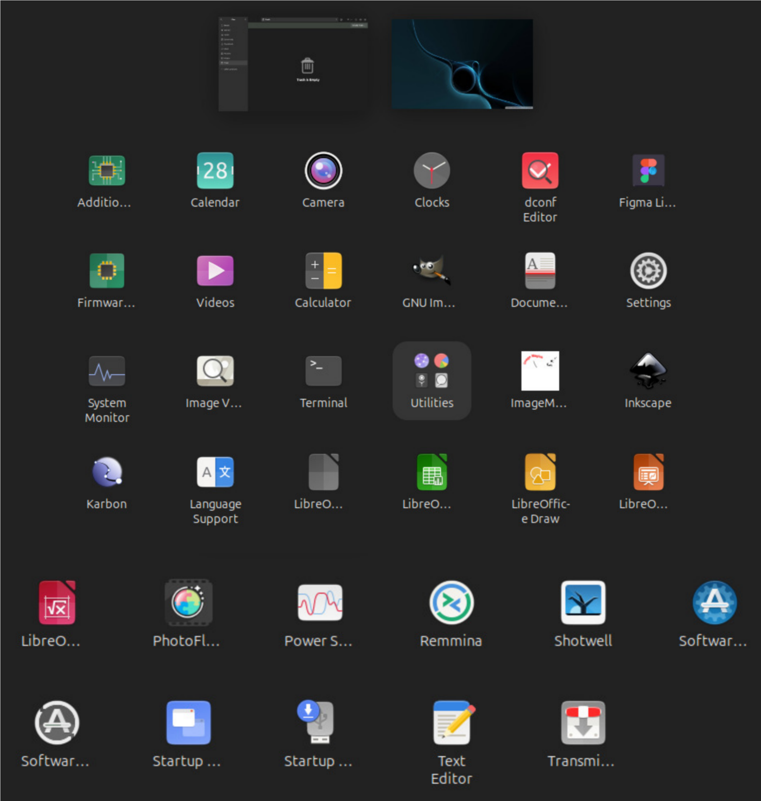

# uDesign 
# Linux Distro for Graphic Designers

## Overview

This document provides a report on a Linux distribution specifically designed for graphic designers and creatives. This distribution comes pre-installed with design software, making it easier for users to perform creative work without the need for manual installation.

## Contents
- Introduction
- List of Software
  - GIMP
  - Inkscape
  - Figma
  - PhotoFlare
  - LibreOffice
  - Karbon
- Linux Distro Interface
- Conclusion

## Introduction
Most graphic design work requires various software that needs specific configurations. To meet these needs, a Linux distribution designed specifically for designers will greatly assist in creating an efficient work environment.

## List of Software

### 1. GIMP
- **Description**: GIMP (GNU Image Manipulation Program) is an open-source image editing application that serves as the primary alternative to Adobe Photoshop on Linux.
- **Features**:
  - Supports various image file formats.
  - Customizable interface.
  - Good performance due to system optimization.

### 2. Inkscape
- **Description**: Inkscape is a popular vector graphic editor software in the Linux environment.
- **Features**:
  - Easy installation through the package manager.
  - Well-integrated across various Linux distributions.

### 3. Figma
- **Description**: Figma is a popular interface design application that can run on Linux through several methods.
- **Features**:
  - Accessible via web browsers.
  - Figma Desktop can be installed through Flatpak or alternative applications.

### 4. PhotoFlare
- **Description**: PhotoFlare is a lightweight image editing application designed specifically for Linux.
- **Features**:
  - A simple alternative for basic photo editing.
  - Can be installed through official repositories or AppImage files.

### 5. LibreOffice
- **Description**: LibreOffice is an open-source office software suite that serves as the primary alternative to Microsoft Office on Linux.
- **Features**:
  - Good compatibility with Microsoft Office document formats.
  - Comprises several components such as Writer, Calc, Impress, Draw, Base, and Math.

### 6. Karbon
- **Description**: Karbon is a vector graphic application that is part of the KOffice suite (now known as Calligra Suite).
- **Features**:
  - Intuitive interface for drawing and editing vector-based images.
  - Transformation tools for manipulating objects.

## Linux Distro Interface
- This Linux distribution will use Ubuntu version 20.04 as its base.
- An efficient work environment that supports productivity will be created with pre-installed software.

## Conclusion
This Linux distribution designed specifically for graphic designers will help create an efficient work environment and support productivity without the need for additional manual software installations.
